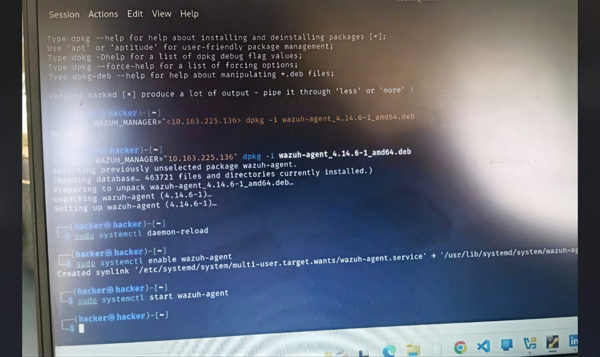
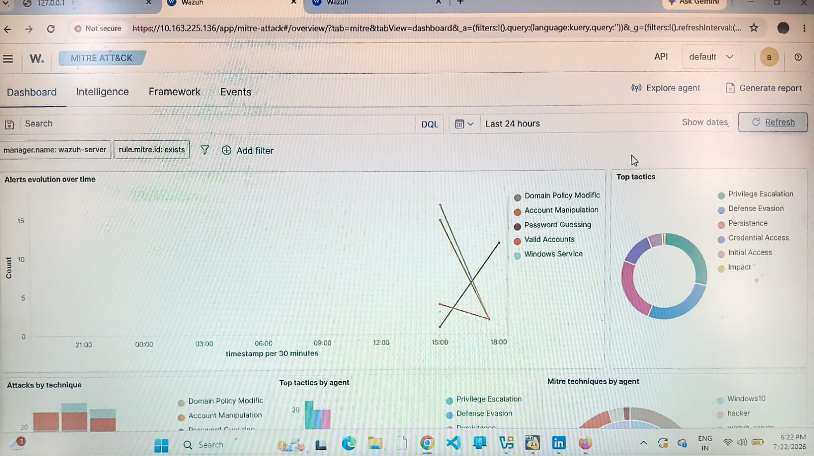
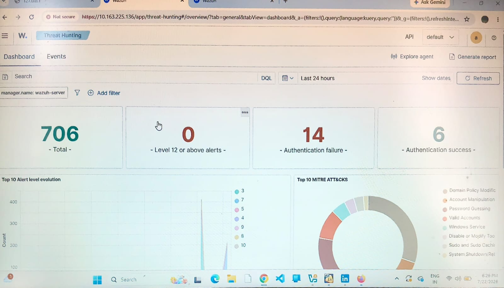

# SOC Home Lab - Wazuh SIEM Deployment & Threat Monitoring

## Project Overview

Implemented a Wazuh SIEM home lab on an Acer PC and Windows to monitor endpoint logs, analyze MITRE ATT&CK threats, and detect authentication failures via a central dashboard.

---

## Architecture & Implementation Steps

### 1. Environment Setup
Wazuh Server: 
Deployed and hosted on a local server (IP: 10.163.225.136).

Endpoints Monitored:
  Linux Endpoint :Agent installed with IP 192.168.100.5.
  Windows Endpoint:Windows 10 instance connected to the manager.

### 2. Agent Installation (Linux Command Reference)
```bash
sudo WAZUH_MANAGER="10.163.225.136" dpkg -i wazuh-agent_4.14.6-1_amd64.deb
sudo systemctl daemon-reload
sudo systemctl enable wazuh-agent
sudo systemctl start wazuh-agent

Lab Screenshots & Evidence
1. Linux Agent Installation & Status
Description:
 Successful installation and active running status of the Wazuh agent on the Linux Acer PC. Verified that the agent service is actively communicating with the central Wazuh manager via secure channels.
screenshot:



2. Wazuh Discover / Logs (Authentication Failure)
Description: Captured PAM and unix_chkpwd system logs displaying explicit failed password attempts (Rule ID: 5557, Severity Level 5).
This validates how raw operating system logs are parsed into structured security events.


3. MITRE ATT&CK Dashboard Analysis
Description:
Real-time mapping of detected security events against the MITRE ATT&CK framework, categorizing the malicious or failed login attempts under Credential Access (Technique: T1110.001 - Password Guessing).




4. Threat Hunting Summary & Analytics
Description:
Comprehensive overview showing total alert metrics, agent distribution across the network, and frequency of authentication failures to monitor overall endpoint security posture.




Conclusion
This hands-on SOC home lab successfully demonstrates endpoint log collection, SIEM monitoring, threat detection engineering, and incident investigation workflows.
